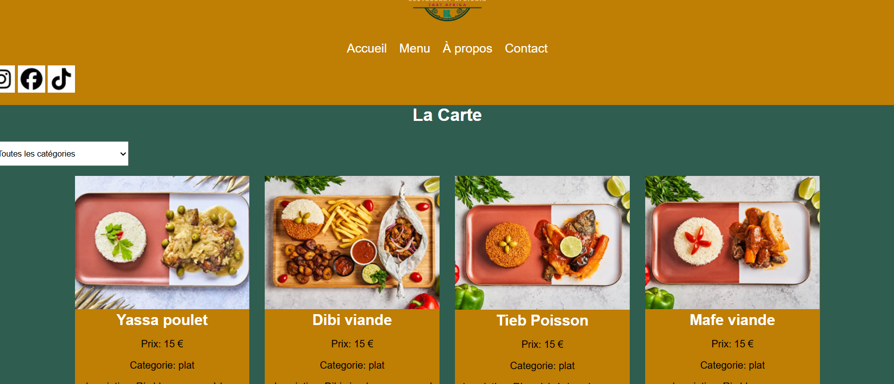

# Titre du Projet

 TastAfrica - Application de restauration  




## Description 

TastAfrica est une application web et web mobile portant sur le thème de la restauration .
Sue ce site vous découvrirai la cuisine Ouest africaine , des fonctionnalités pour commandé et reservé en ligne  .

Structure du projet 

Tastafrica/
├── index.html
├── detail.html
├──liste.html
├── contact.html
├── css/
│   ├── style.css
|   └── burger.css  
├── js/
│   ├── index.js
│   └── burger.js
└── README.md

## les Compétences visées 

## Réaliser des interfaces utilisateur statiques web et web mobile

Developpement de pages web utilisant html5 et Css 3 
comprehension de la mise en page responsive 
Codage en HTML5 et CSS3 pour structurer des pages web et appliquer des styles
Respect des bonnes normes de developpement en respectant les balises correspondantes


### Développer la partie dynamique des interfaces utilisateur web ou web mobile

- Programmation en JavaScript, 
- Fonction Fetch 
- Affiche du menu Json 
- Manipulation du Dom 
**Exemple** : Utilisation de JavaScript pour rendre les interfaces interactives.
<!-- utilisation de bibliothèques et frameworks pour enrichir l'interaction utilisateur. -->

## Fonctionnalités
- Affichage en grille responsive (4 colonnes desktop, 1 colonne mobile)
-  Page de détails avec ingrédients et instructions
- Menu Burger en responsive design
<!-- - Recherche de plats par nom -->
- Recherche par categorie 
- Formulaire de Contact 
- Design moderne et accessible

## Technologies utilisées

- HTML5 (balises sémantiques)
- CSS3 (Flexbox, Grid, Media Queries)
- JavaScript ES6 (Fetch API, Modules)
- API : DummyJSON (https://dummyjson.com/recipes)

## Installation

1. Cloner le repository
```bash
git clone https://github.com/syllad119-sudo/TastAfrica
cd TastAfrica 
-
